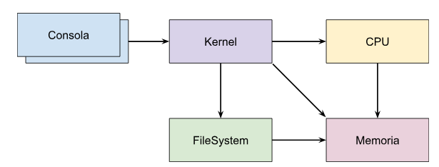

# tp-2023-1c-Black-Suits

This is a group project for the Operating Systems subject in UTN FRBA.
Teammates:
- Abril Caruso
- Guadalupe Fernández
- Franco Modesto
- Mora Rodriguez

They are all tagged as collaborators for this repository.

The project consists of the simulation of different parts of a real operating system designed according to the theory we learnt in class and the specifications given by the evaluators. (https://docs.google.com/document/d/1orfThJsPmMx5uPzbY3wClGhqX8jASMOCUMlWnYAr7cA/)

Each module (Kernel, File System, Memory, CPU and multiple Consoles) consists of a multi-threaded process that communicates with the other modules through TCP/IP connections, using sockets, as seen in the following schema:

.

## How to run it
To compile the project, it is required to have the following library installed: https://github.com/sisoputnfrba/so-commons-library

Then follow this steps:
 - Run `make` inside each module's folder.
 - Set the config files for each module to match IP addresses and ports, you can change other values if you like to test it further.
 - Run all the modules (except for the consoles) in different terminals following this order:
	 - `./memoria` -> `./cpu` -> `./filesystem` -> `./kernel`
 - Then, for each script you want to run in the system, open a new terminal and run `./consola [path to config file] [path to script]`.
- Finally, you can see in the logs how the system behaves according to the given scripts.

Notes: 
- The scripts format is shown in the specifications document.
- Some nice tests are provided here: https://docs.google.com/document/d/1MNalaTCB95qGO8q3rlR7VVCQqv3VLP3oeYxBgXgBy5g/
